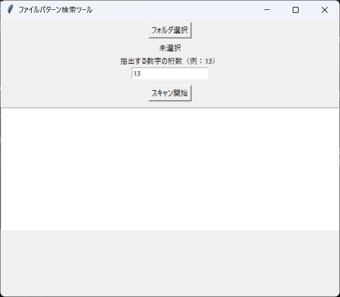

★File Pattern Scanner（ファイルパターン検索ツール）★

フォルダ内のファイル名から、指定した桁数の数字パターンを抽出し、一覧として出力するツールです。
管理番号や商品IDなど、一定のルールを持つ番号をまとめて取得できるように作成しました。

■ 想定用途

・商品管理番号の抽出  
・ファイル名からのID一覧取得  
・データ整理・棚卸し作業の効率化  

■ 機能

・フォルダの再帰スキャン  
・指定した桁数の数字パターン抽出  
・抽出結果の一覧CSV出力  
・GUI操作対応（フォルダ選択・条件入力・実行）  

■ 使用方法

1. アプリを起動  
2. 対象フォルダを選択  
3. 抽出する数字の桁数を入力  
4. スキャン開始  

処理完了後、result.csvとして出力されます。

■ 画面イメージ

■ 入力例（ファイル名）

1234567890123.jpg  
test_1234567890123.csv  
abc.txt  
9999999999999.png  

■ 出力内容

・抽出された数字  
・ファイル名  
・拡張子  
・フルパス  

■ 作成背景

大量のファイルの中から管理番号を手作業で確認していたため、
作業時間短縮とミス防止を目的に作成しました。

■ 注意事項

・本ツールは数字パターンの抽出に特化しています  
・実運用に応じて条件の拡張が可能です  

■ 今後の改善

・文字列条件の追加  
・複数条件での抽出対応  
・UIの改善
